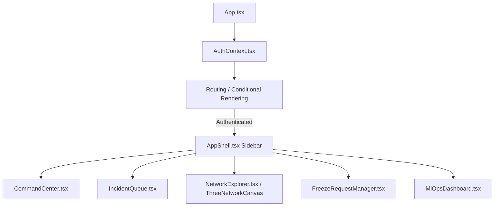

# sihweb - Tritrinetraa Frontend

## Purpose
`sihweb` is the user-facing Single Page Application (SPA) for the TRINETRAA platform. It serves two distinct audiences:
1. **Cyber Officers & Bank Employees**: A high-fidelity command center to view ML-scored incidents, orchestrate emergency account freezes, explore 3D money mule graphs, and track active MLOps health.
2. **Citizens**: (Via the public routing path) Interfaces to file new cyber complaints and upload transaction evidence.

## Tech Stack
- **Framework**: React 18, Vite
- **UI & Styling**: Tailwind CSS, Lucide React (Icons), `clsx`/`tailwind-merge`
- **Visualization**: Three.js (3D Network Explorer), Recharts (MLOps & telemetry), React-Leaflet (Cash-Out Geo Map)
- **State Management**: React Context (`context/AuthContext.tsx`), standard React hooks
- **Deployment**: Vercel

## Folder Structure
- `src/assets/`: Static image assets and stylesheets (`index.css`).
- `src/components/`: Modular React components, deeply grouped by domain (`auth`, `command`, `complaints`, `dossier`, `freeze`, `graph`, `mlops`, `network`, `simulation`, `streaming`, `geo`).
- `src/context/`: Global React context providers (e.g., Auth, Theme).
- `src/services/`: API integration layer (`api.ts`).
- `src/types/`: Shared TypeScript interfaces and DTO definitions.
- `src/utils/`: Common helper functions and validators.

## Feature List
- **Command Center**: The primary dashboard summarizing queue stats, recent high-risk alerts, and SLA statuses.
- **Incident Queue**: A list of scored complaints, natively paginated and ranked by ML risk probability.
- **Explainability Dossier**: Detailed view of a single incident, showing the GraphSAGE risk tier, extraction patterns, and transaction timelines. *(Note: "Case Dossiers" tab is currently hidden via `AppShell.tsx` pending completion).*
- **3D Network Explorer**: WebGL (Three.js) graph rendering of the money laundering ring, allowing officers to pan, zoom, and inspect specific nodes.
- **Geo-Map (Cash-Out Map)**: A Leaflet integration tracking terminal/ATM coordinates where illicit funds are exited.
- **Streaming Demo (Simulation Lab)**: Evaluates live transaction stream batches against the ML model in real-time.
- **MLOps Dashboard**: Monitors model telemetry, drift, F1/PR-AUC scores, and model promotion (Candidate -> Champion).
- **Threshold Policy Sweeper**: Simulates the effect of adjusting the risk alerting threshold on total alert volume and precision.
- **Emergency Freezes**: Modal and management view to issue instant SLA-bound freeze requests to partner banks.

## API Integration
All data fetching is abstracted into a single static class `ApiService` inside `src/services/api.ts`.
- **Base URL**: Controlled by `VITE_API_BASE_URL` (locally) or defaults to relative `/api` paths (in production).
- **Auth Token Handling**: On login, `api.ts` stores the JWT in `localStorage` under the key `sih_staff_token`. Subsequent requests attach it via `this.getHeaders()` inside an `Authorization: Bearer <token>` header.
- **Graceful Degradation**: `api.ts` makes heavy use of `try/catch` and `res.ok` checks.

## Component Architecture



## Environment Variables
- `VITE_API_BASE_URL`: The base URL pointing to the `sihback` API Gateway (e.g., `http://localhost:8000/api`).

## Local Development
Requires Node.js and NPM.
```bash
# Install dependencies
npm install

# Run local Vite dev server
npm run dev

# Typecheck and build production bundle
npm run build
```

## Deployment
Deployed to **Vercel**. The configuration is managed in `vercel.json`, which defines two critical proxy rules:
1. `source: "/api/:match*"` -> Rewrites to the Railway-hosted `sihback` gateway (`https://sihback-production.up.railway.app/api/:match*`). This bypasses CORS issues.
2. `source: "/(.*)"` -> Rewrites to `/index.html` to allow React Router to handle client-side routing.

## Known Limitations
To ensure the dashboard does not visibly crash during live presentations if the backend omits specific fields or goes offline, `services/api.ts` implements **aggressive mock fallbacks**.
- **Emergency Freezes**: Because of isolated schemas between the Java Postgres and Python SQLite, creating a new Freeze Request is currently handled by local mock state. Creating a freeze caches it into `localStorage` (`sih_mock_freeze_requests`) rather than writing to Postgres.
- **Telemetry / Stats**: Functions like `getAdminStats`, `getMlOpsDashboard`, and `getPolicyImpact` will silently fall back to hardcoded JSON objects if the `sihback` API fails or returns a 500 error.

